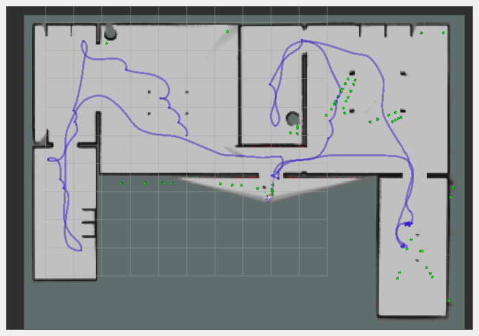

# Autonomous-Turtlebot
Autonomous Turtle Bot capable of performing autonomous SLAM using Cartogrpaher and NAV2 in ROS2 Humble

## Project Overview
This project combines ROS 2 Humble, Cartographer for SLAM, Nav2 for navigation, and a custom exploration node to create an autonomous robot capable of mapping an unknown environment. The system is designed to work with a TurtleBot3 in a Gazebo simulation, but can be adapted for other robots and real-world scenarios.
Key features:

- Autonomous exploration and mapping
- Integration with Cartographer for SLAM
- Nav2 for path planning, control, and obstacle avoidance
- Custom exploration strategy for efficient area coverage
- Visualization of frontiers and robot path in RViz

## Dependencies
- Ubuntu 22.04 (or compatible)
- ROS 2 Humble
- Gazebo
- TurtleBot3 packages for ROS 2
- NAV2
- Cartographer
- Python 3.8+
- NumPy
- scikit-learn

## Installation

Set up your ROS 2 Humble workspace:
```bash
mkdir -p ~/ros2_ws/src
cd ~/ros2_ws/src
```
Clone this repository into your workspace:
```bash
git clone https://github.com/gadirajus13/autonomous_tb.git
```

## Install dependencies:

```bash
sudo apt update
sudo apt install ros-humble-cartographer ros-humble-cartographer-ros ros-humble-navigation2 ros-humble-nav2-bringup ros-humble-turtlebot3-gazebo
pip3 install numpy scikit-learn
```

Build the workspace:
```bash
cd ~/ros2_ws
colcon build
source install/setup.bash
```

## Usage
1. Launch the simulation and start the autonomous exploration:

```bash
ros2 launch autonomous_tb exploration.launch.py
```
This will start Gazebo with a TurtleBot3 in a house environment, launch Cartographer for SLAM, start Nav2 for navigation, and run the custom exploration node.

2. Monitor the progress:
- Use RViz to visualize the map building process, robot's path, and detected frontiers.
- To view the frontier markers, add a Marker Array to your RViz and select the 'frontiers' topic
- Check the terminal output for status updates and any error messages.

4. To stop the exploration:
- Save the map using the typical Nav2 save methodology in the terminal
```bash
ros2 run nav2_map_server map_saver_cli -f my_map
```
- Press Ctrl+C in the terminal where you launched the exploration node to terminate the program once map is saved.


## Project Structure

- ```exploration_node.py```: Main Python script implementing the autonomous exploration algorithm.
- ```exploration.launch.py```: Launch file that sets up the entire system, including Gazebo, Cartographer, Nav2, and the exploration node.
- ```config/nav2_params.yaml```: Configuration file for Nav2 parameters.

## Configuration
You can modify the following files to adjust the behavior of the system:

- ```exploration_node.py```: Adjust exploration parameters such as cluster_tolerance, min_frontier_size, obstacle_clearance, and min_goal_distance.
- ```config/nav2_params.yaml```: Modify Nav2 parameters to fine-tune navigation behavior.
- ```exploration.launch.py```: Change the Gazebo world, robot starting position, or add/remove nodes from the launch process.

## Demo
Here is a demonstration of the exploration node running in the default Gazebo House and World environments




## Data Collection Node
If you want to collect data from the lidar and camera while running your simulation. Use the following,

To launch the Gazebo simulation and run the data collection node for the camera's and lidar from the Turtlebot Waffle Pi, run:
```
 ros2 launch autonomous_tb data_collection_launch.py
```

To control the turtlebot during data collection, in another terminal window run:
```
ros2 run turtlebot3_teleop teleop_keyboard
```
